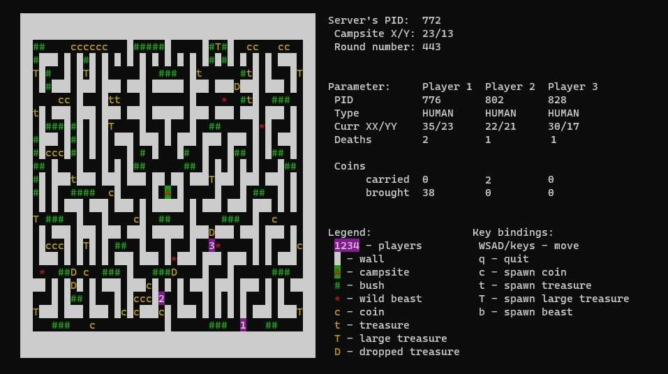
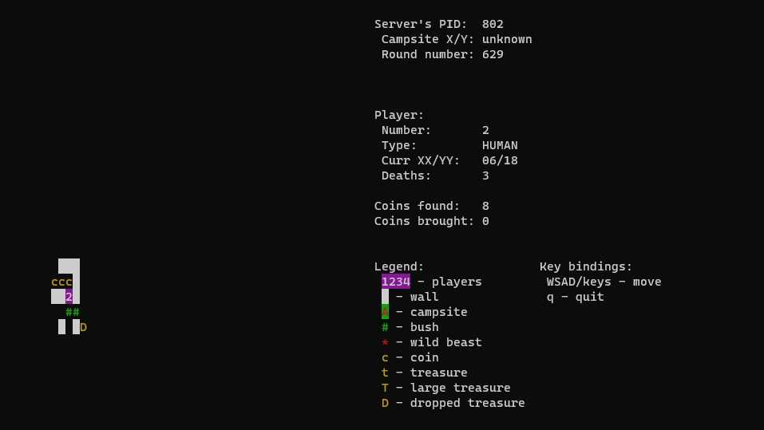

# Beasts but it's C
The game was written as a project of "Operating Systems" classes to consolidate knowledge of threads and IPC.

## Authors

- [@MendelDamian](https://www.github.com/MendelDamian)


## Tech stack

- UNIX Sockets
- Threads
- ncurses - graphics library


## Demo




## Build

To build this project run

```bash
  make
```


## Run Locally

Clone the project

```bash
  git clone https://github.com/MendelDamian/Beasts-but-it-is-C
```

Go to the project directory

```bash
  cd Beasts-but-it-is-C
```

Start the game by using Makefile

```bash
  make run
```
or directly
```bash
  ./build/Beasts
```

